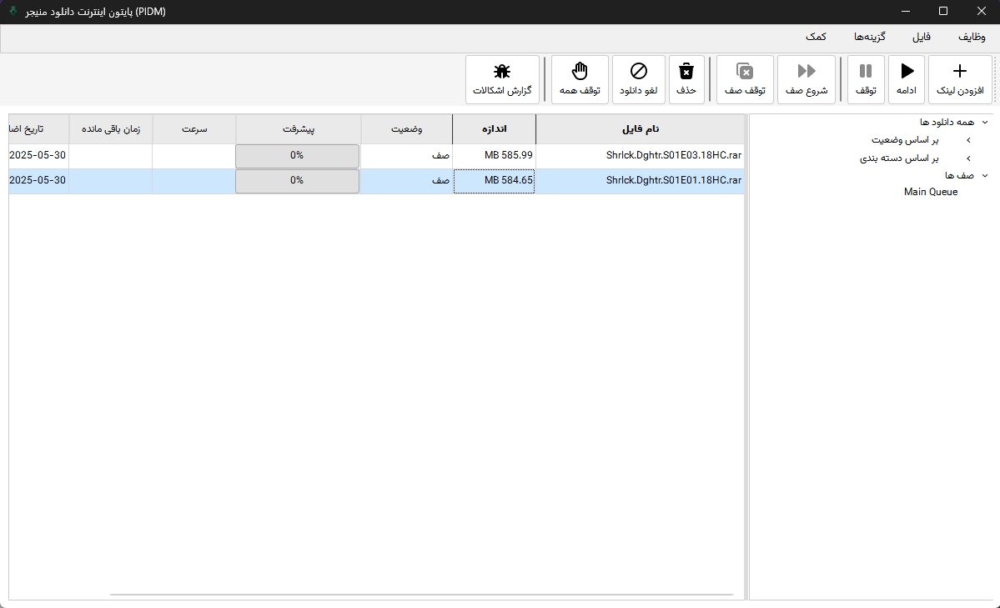
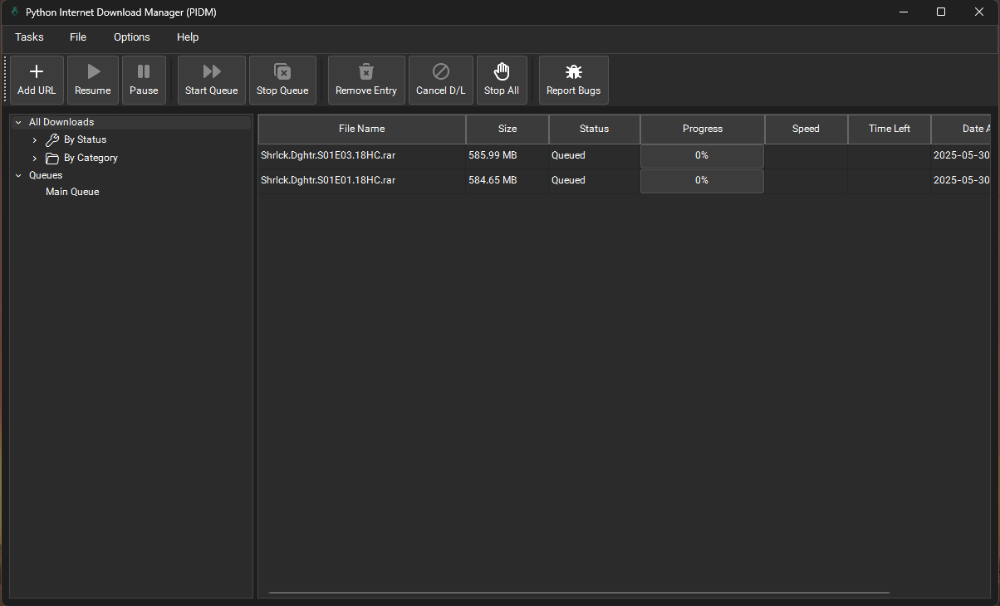

# PIDM - Python Internet Download Manager


PIDM is a powerful and modern internet download manager written in Python using PySide6 (Qt). It features advanced queue handling, browser extension integration, metadata prefetching, resume support, and a clean, theme-aware GUI.

---

## 🔥 Features

- ✅ Modern Qt-based interface (PySide6)
- 🚀 Multithreaded download engine with resume support
- 📁 Queue system with scheduling and concurrent limits
- 🌐 Browser extension support (Chrome-based)
- 🧠 Smart metadata prefetch (type, size, name)
- 🎨 Light/Dark theme with auto-detection
- 💾 Persistent SQLite database & resume metadata
- 🌍 Multilingual support (English, فارسی, ...)
- 🔐 Authentication handling (Basic/Digest)
- 📡 Global & per-download speed limiter
- 🔌 Native messaging support for browser triggers

---

## 📷 Screenshots




---

## 🛠️ Installation

### 🔽 Download Executable (Windows)

> Download the latest release from the [Releases](https://github.com/saeedmasoudie/PIDM/releases) page.

### ⚙️ Run From Source

1. **Clone the repo**:
    ```bash
    git clone https://github.com/yourusername/pidm-download-manager.git
    cd pidm-download-manager
    ```

2. **Install dependencies**:
    ```bash
    pip install -r requirements.txt
    ```

3. **Run the app**:
    ```bash
    python main.py
    ```

## 🧪 Requirements

- Python 3.9+
- PySide6
- httpx
- sqlite3 (built-in)
- Other dependencies in `requirements.txt`

---

## 🌍 Translation

PIDM supports multiple languages. You can contribute via `.ts` and `.qm` files under `assets/translations`.

---

## 🧩 Roadmap

- [x] Native messaging support
- [x] Theme-aware SVG icons
- [x] Speed limiting per download
- [ ] Advanced browser video grabbing (blob)
- [ ] Firefox/Edge support
- [ ] Plugin system for mirror selection

---

## 🛡️ License

MIT License © [Saeed Masoudi](https://github.com/saeedmasoudie)

---

## ❤️ Contributing

Pull requests, bug reports, and feature suggestions are welcome!

1. Fork the repo
2. Create your branch: `git checkout -b feature/your-feature`
3. Commit your changes: `git commit -m "Add new feature"`
4. Push to the branch: `git push origin feature/your-feature`
5. Open a pull request

---

## 📫 Contact

For feedback or bug reports, open an issue or reach out via GitHub Discussions.

